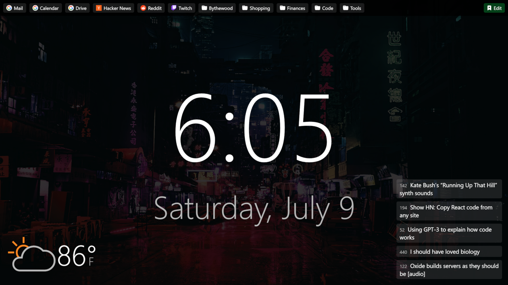

# New tab

A clean new tab page extension for Chrome made by Isaac Bythewood, you can grab
it and customize it yourself.

## Installation

Download the files:

    https://github.com/overshard/newtab/archive/refs/heads/master.zip

Or clone the repository:

    git clone https://github.com/overshard/newtab.git

- Unpack the files on your system somewhere
- Go to [chrome://extensions](chrome://extensions) in you browser
- Enable `Developer mode` on the top right
- Click `Load unpacked` and select the folder you unpacked the files to

## Customization

The easiest customization is swapping out the `background.webp` image.

The weather is based on my location in Morganton, NC so if you want somewhere
else swap out the AccuWeather link in `newtab.js`. My location looks like this:

    https://www.accuweather.com/en/us/morganton/28655/weather-forecast/334823

You can just search for your location on the AccuWeather website and copy the
url of the resulting page.

## Credits

The current `background.webp` image credits go to
[Valentin Petrov](https://www.artstation.com/valentinpetrov). You can find this
exact image on [ArtStation](https://www.artstation.com/artwork/wnD16).
